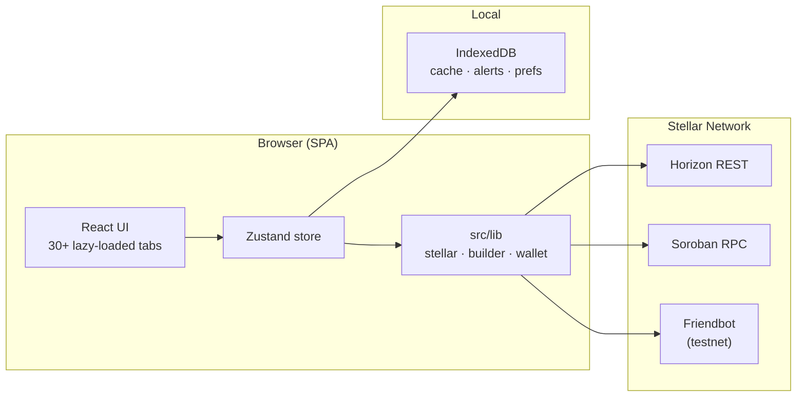

# Stellar Dev Dashboard

A real-time, open-source developer dashboard for the Stellar network — built with Vite and React.


Connect a Stellar public key or wallet and explore accounts, transactions, Soroban contracts, network stats, and transaction tooling — all in the browser. No backend required; data comes from public Horizon and Soroban RPC endpoints.

**Live demo:** [stellar-dev-dashboard.netlify.app](https://stellar-dev-dashboard.netlify.app)

---

## Architecture



**Request flow:** `ConnectPanel` validates a key or wallet → `stellar.ts` fetches account data from Horizon → dashboard tabs read/write via Zustand → Soroban ops simulate/submit through RPC.

---

## Quick Start

```bash
npm install
npm run dev       # http://localhost:5173
npm run build     # production build → dist/
npm run preview   # preview production build
```

Node 18+. No environment variables needed for default networks.

---

## Features

| Area | What you get |
| --- | --- |
| **Account** | Balances, signers, flags, offers, claimable balances, USD estimates |
| **History** | Paginated transactions and operations with search and filters |
| **Soroban** | Contract inspect, simulate, invoke, ABI viewer |
| **Network** | Live ledger stats, SSE streams, fee analytics |
| **Build** | Transaction builder, simulator, Freighter/Ledger signing |
| **Explore** | SDEX order books, path payments, external explorer links |
| **Tools** | Multisig, alert rules, portfolio analytics, data export, audit log |

Supports **Mainnet**, **Testnet**, **Futurenet**, **Local**, and **Custom** network profiles.

---

## Tech Stack

| Package | Role |
| --- | --- |
| Vite 5 + React 18 | Build tool and UI |
| `@stellar/stellar-sdk` | Horizon, Soroban RPC, XDR |
| Zustand | Global state |
| Recharts | Charts and metrics |
| i18next | Internationalization |
| Vitest + Playwright | Unit, integration, and E2E tests |

Core lib files (`stellar.ts`, `store.ts`) are TypeScript; components are a mix of `.jsx` and `.tsx` during migration.

---

## Project Layout

```
src/
├── App.tsx              # Routing, layout, lazy tab loading
├── main.jsx             # Entry point, service worker
├── components/
│   ├── dashboard/       # One component per feature tab
│   ├── layout/          # Sidebar, mobile nav, search
│   └── …                # charts, multisig, assets, notifications
├── lib/                 # Business logic (no React)
│   ├── stellar.ts       # All Stellar SDK integration
│   ├── store.ts         # Zustand global state
│   └── wallet/          # Freighter, Ledger connectors
├── hooks/               # React hooks
├── i18n/                # Translation files
└── styles/              # CSS tokens, themes, responsive rules
```

---

## Networks

| Network | Horizon | Soroban RPC |
| --- | --- | --- |
| Testnet | `horizon-testnet.stellar.org` | `soroban-testnet.stellar.org` |
| Mainnet | `horizon.stellar.org` | `soroban-rpc.stellar.org` |
| Futurenet | `horizon-futurenet.stellar.org` | `soroban-futurenet.stellar.org` |
| Local | `localhost:8000` | `localhost:8000/soroban/rpc` |
| Custom | User-defined | User-defined |

Switching networks in the sidebar resets account-specific state.

---

## Scripts

| Command | Description |
| --- | --- |
| `npm run dev` | Development server |
| `npm run build` | Production build |
| `npm run build:pages` | Production build for GitHub Pages (subpath + SPA fallback) |
| `npm run build:analyze` | Build + bundle treemap (`dist/stats.html`) |
| `npm test` | Run Vitest unit tests |
| `npm run test:e2e` | Run Playwright E2E tests |
| `npm run lint` | ESLint |
| `npm run type-check` | TypeScript check |

CI enforces a **500 KB gzipped** bundle budget on the main entry chunk.

---

## Deployment

**Production:** [https://stellar-dev-dashboard.netlify.app](https://stellar-dev-dashboard.netlify.app) (Netlify)

```bash
npm run build
netlify deploy --prod --dir=dist
```

Netlify config lives in [`netlify.toml`](netlify.toml) (build command, publish dir, SPA redirects).

Alternative targets: [GitHub Pages](.github/workflows/pages.yml) (`npm run build:pages`) or [Vercel](.github/workflows/deploy.yml) (requires `VERCEL_*` secrets).

---

## Contributing

Pull requests are welcome. Check open issues to find something to work on.

---

## License

MIT
