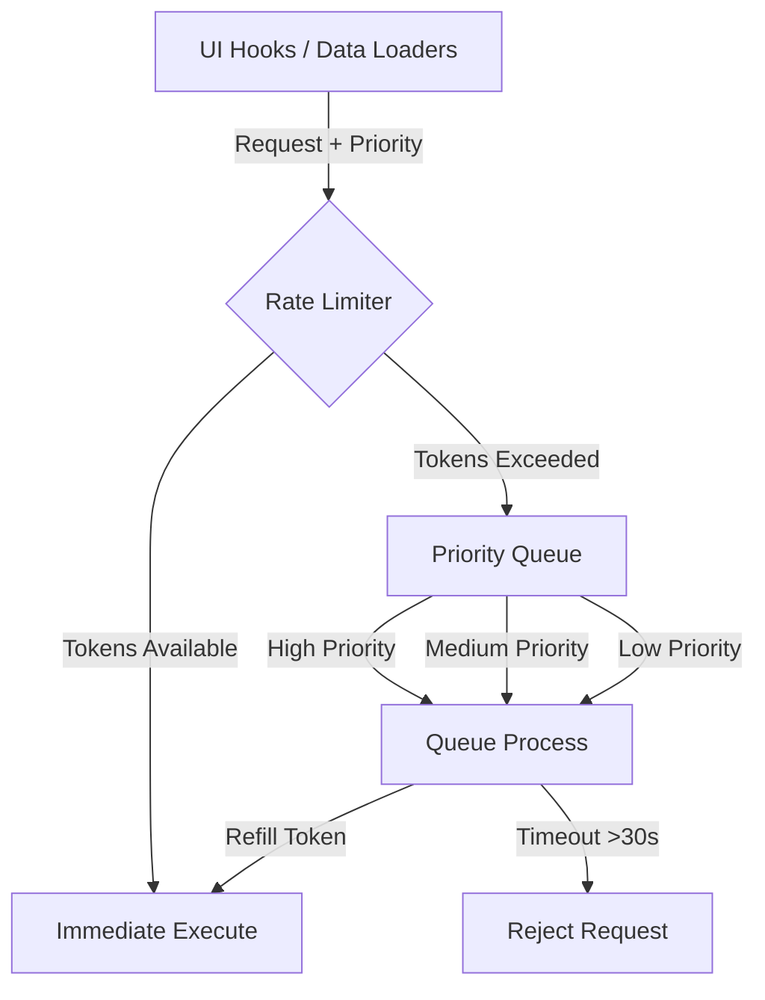

# API Rate Limiting & Queue Management

All external API interactions from the **Stellar Dev Dashboard** (to Horizon, Soroban RPC, and CoinGecko) are gated and prioritized by an advanced client-side rate limiting and scheduling system. This prevents application actions from triggering HTTP `429 (Too Many Requests)` errors and keeps the interface active during heavy traffic.

This system is implemented in `src/lib/rateLimiter.js` and provides token bucket rate limiting, priority queuing, and request coalescing.

---

## 1. Core Architecture

The rate limiter acts as a middleware layer between the UI hooks (e.g. `usePersistedState`, data loaders) and the network. It uses a **Token Bucket** algorithm combined with **Priority Queues** to schedule outgoing requests.



---

## 2. Configured Rate Limits

Default and endpoint-specific limits are enforced per IP address/client identifier inside `src/lib/rateLimiter.js`. A single time window is set to **1 minute (60,000ms)**.

| Endpoint Target | Max Requests / Min | Priority Tier | Description / Scenario |
|-----------------|--------------------|---------------|------------------------|
| `/accounts` | `20` | `High` | Connected account details, balances, and signers. |
| `/transactions` | `15` | `Medium` | Paginated transaction lists, history, and records. |
| `/operations` | `25` | `Medium` | Paginated operation lists. |
| `/assets` | `10` | `Low` | Price feed mapping and assets search. |
| `/contracts` | `5` | `High` | Soroban simulations and get contract code. |
| `default` | `30` | `Medium` | Default fallback rate for unclassified requests. |

---

## 3. Queue Priority Scheduling

When outgoing requests exceed the maximum limit for a time window, the system automatically buffers them in three internal priority lists:

*   **High Priority (`priority: 'high'`)**:
    *   *Triggers*: Contract simulations, transaction submissions, Friendbot faucets, and initial wallet connection.
    *   *Handling*: Processed immediately when a token becomes available.
*   **Medium Priority (`priority: 'medium'`)**:
    *   *Triggers*: Tab switches, paginated "Load More" history, and DEX order book refreshes.
    *   *Handling*: Processed after the High priority queue is cleared.
    *   *Timeout*: Dropped and rejected if delayed for more than **30 seconds**.
*   **Low Priority (`priority: 'low'`)**:
    *   *Triggers*: Live ticker price updates, portfolio value recalculations, and diagnostic logs.
    *   *Handling*: Only processed when both High and Medium queues are completely empty.

---

## 4. Throttle Modes

The rate limiter supports two performance modes that can be dynamically switched using `rateLimiter.setThrottleMode(mode)`:

### `aggressive` (Default)
Optimized for developer agility. Requests are executed immediately up to the absolute token capacity. Queued requests are processed every 50ms.

### `conservative`
Optimized for low-bandwidth networks or shared API keys.
*   Outbound throughput is capped at **1/3** of normal capacity.
*   Enforces a maximum queue size of **100 requests**. Any new requests beyond this size are rejected with `Request dropped: queue overflow in conservative mode` to prevent memory leaks.
*   Reduces concurrent parallelism.

---

## 5. Developer Integration Example

All fetch calls to external resources should route through the rate limiter's `queueRequest` facade rather than calling raw `fetch` directly:

```ts
import { rateLimiter } from '@/lib/rateLimiter';

async function fetchAccountSafely(publicKey: string) {
  // Wrap your request details
  const requestConfig = {
    url: `https://horizon-testnet.stellar.org/accounts/${publicKey}`,
    priority: 'high', // 'high' | 'medium' | 'low'
    maxRetries: 3,
    options: {
      method: 'GET',
      headers: {
        'Accept': 'application/json'
      }
    }
  };

  try {
    // Queue the request; returns a Promise that resolves once rate limits permit execution
    const response = await rateLimiter.queueRequest(requestConfig, 'user-ip-address');
    if (!response.ok) {
      throw new Error(`HTTP Error ${response.status}`);
    }
    return await response.json();
  } catch (error) {
    console.error('Request failed or dropped:', error.message);
    throw error;
  }
}
```
